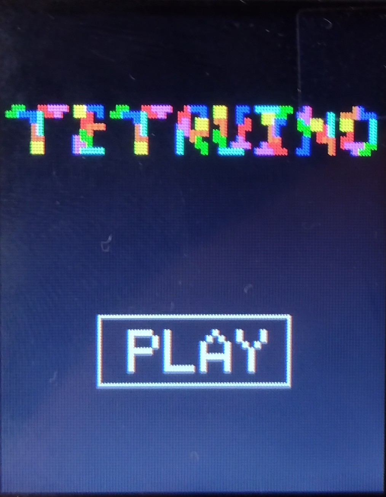
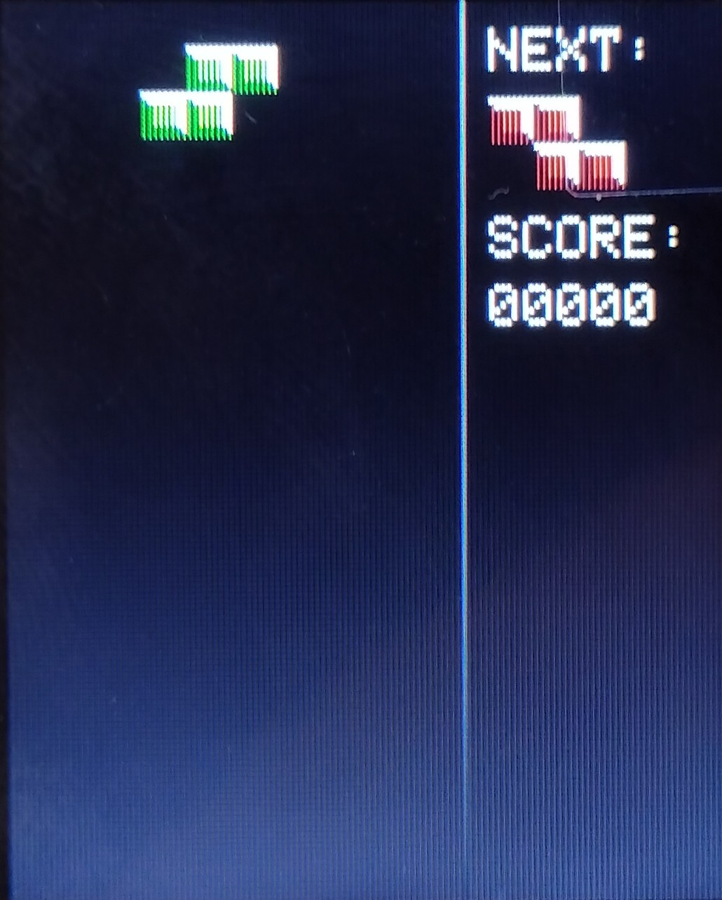
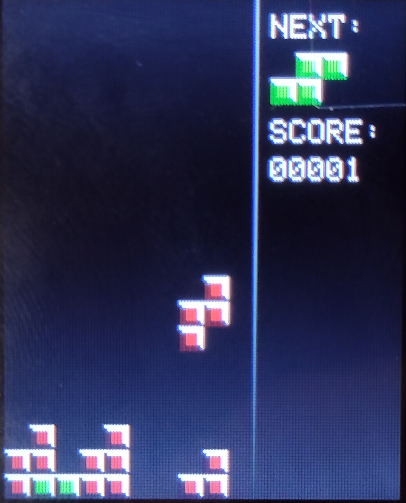
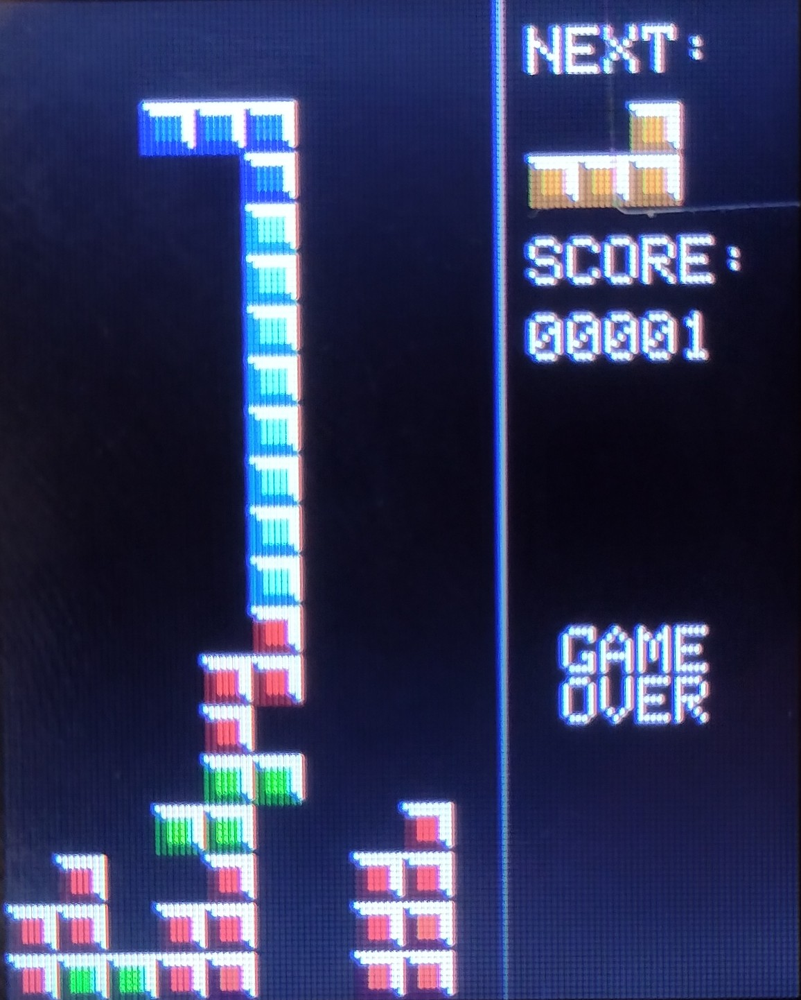

# arduino-tetris
A Tetris game made on Arduino Uno Rev3 with a joystick, holding platform and an AzDelivery 1.77" TFT 160x128 RGB display.
## Wiring

The resistors are used, because Arduino is outputting 5V and the display expects 3.3V.

## Platform
 

## How to play
### Movement
To start press the joystick like a button. Left and right movement of the stick moves the tetrominoes, holding
it up rotates them and pulling downwards makes them fall faster.
### Scoring
Every filled/destroyed row gives you 1 point. (There are no special points like in standard Tetris.)
With every filled row the falling speed/time to move the tetrominoes is getting faster. If the second top most row gets filled
the game ends (second and not first, because the first row is never filled :') ).

## Pictures
 
 
